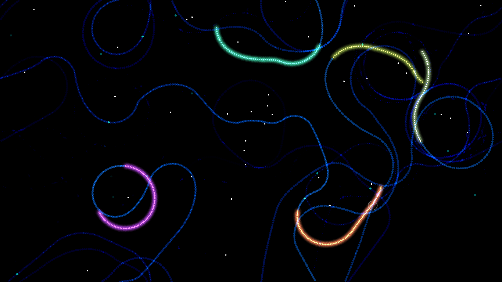

# SpaceSnakes

An experiment with digital life where colorful snakes chase food in space, leaving behind luminous trails.

## Features
- Autonomous snakes that seek food
- Colorful trails that create abstract patterns
- Snake reproduction system
- Interactive food placement with mouse clicks

## Requirements
- LÖVE2D (11.0 or newer) - https://love2d.org/

## Running
